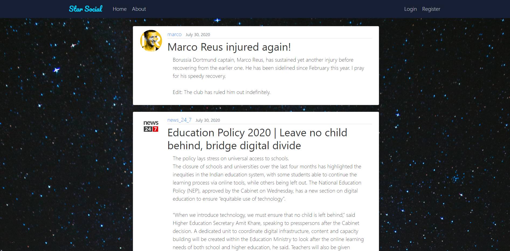
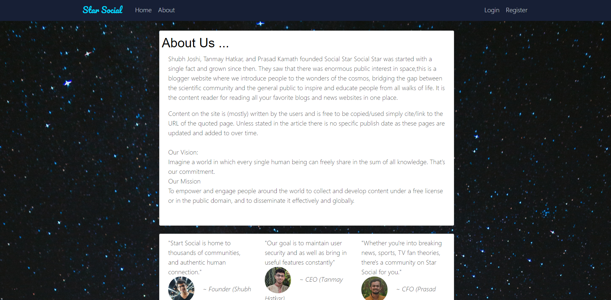
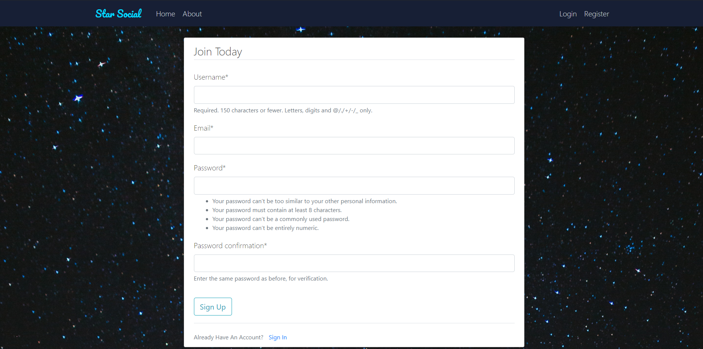
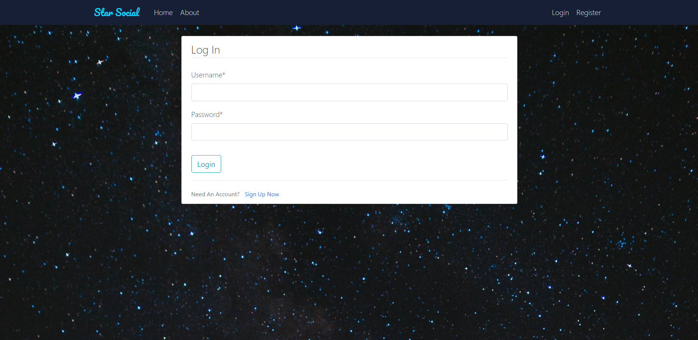
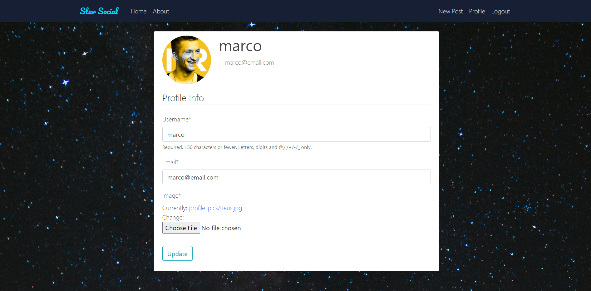
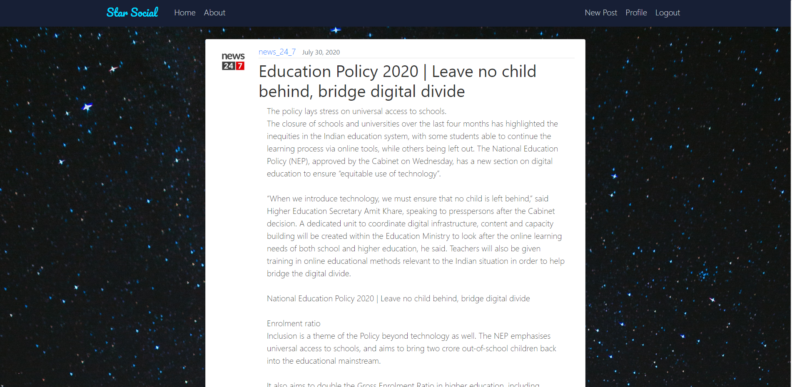
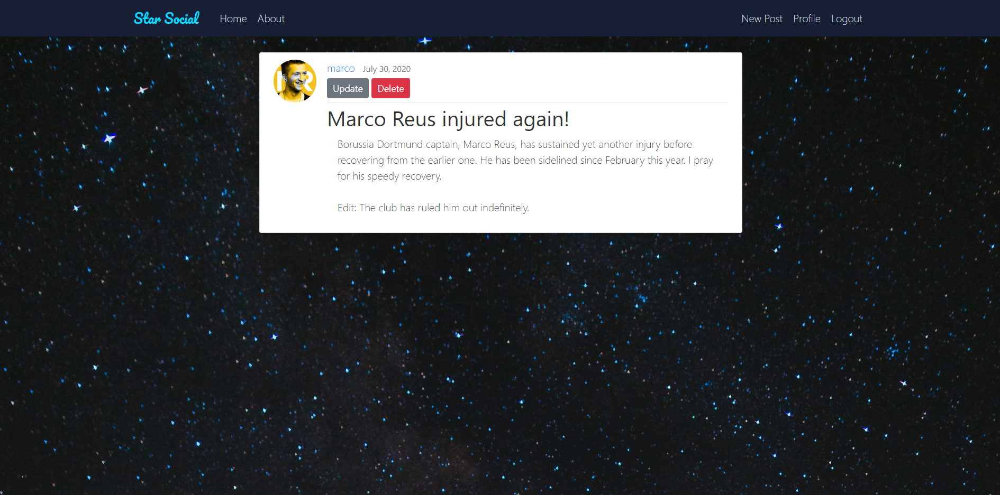
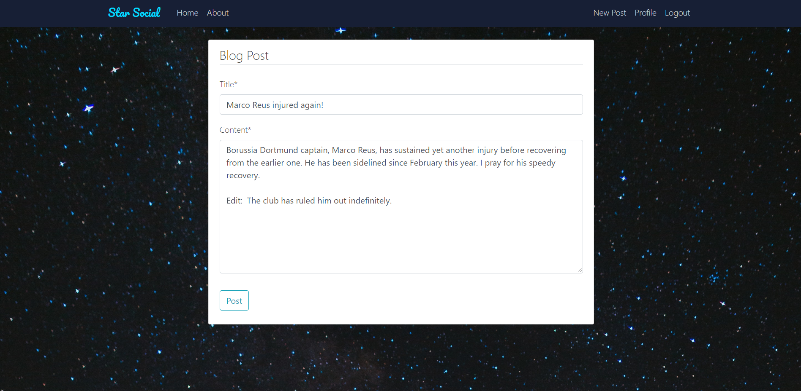
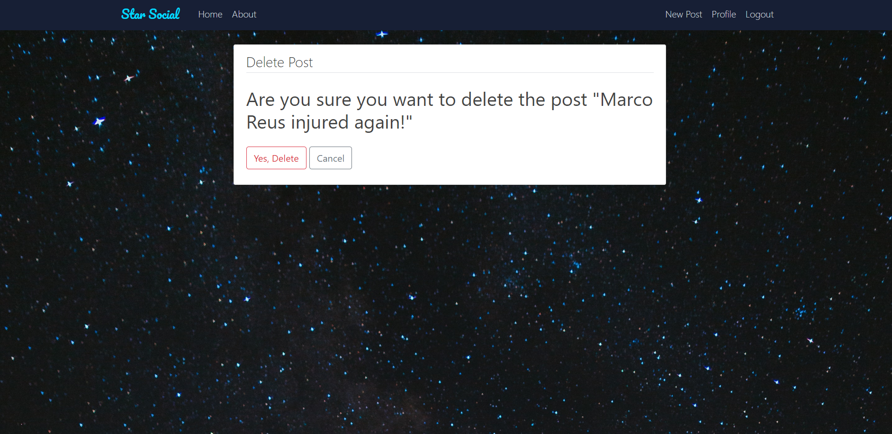

# web-dev-project

## Home page: 
Shows all the posts

## About page:

## Register: 
New users can register here

## Login: 
Users login page

## Profile: 
Profile page. Users can change their profile image, and update their email ID

## Post: 
When a particular post is clicked

If the user is the owner of the blog and click on the blog, user has options to either update or delete the blog

## Update post: 
The user can make changes to title and the actual blog

## Delete post: 
User can delete their blog

